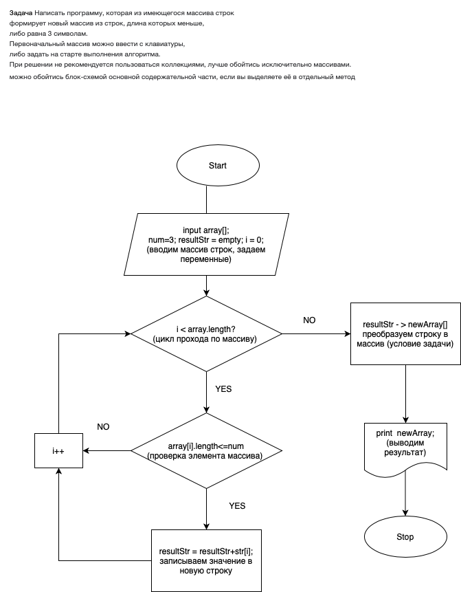

# Итоговая проверочная работа.

## Задача:
Написать программу, которая из имеющегося массива строк формирует массив из строк, длина которых меньше либо равна 3 символа. Первоначальный массив можно ввести с клавиатуры, либо задать на старте выполнения алгоритма. При решении не рекомендуется пользоваться коллекциями, лучше обойтись исключительно массивами.

### Алгоритм решения:
1. Пользователь вводит строку из любых значений, разделенных одним или несколькими пробелами.
2. Преобразуем введенную строку в массив строк.
3. Задаем необходимые переменные в т.ч. значение максимальной длины элемента будущего массива и пустую строку.
4. Перебираем массив и если значение элемента подходит по условию задачи, то кладем его в нашу строку и увеличиваем счетчик прохода. Если условие не выполняется, то просто увеличиваем счетчик.
5. После перебора массива получаем строку с подходящими условию задачи элементами и согласно условию задачи преобразуем строку в массив строк.
6. Выводим результат в консоль.

### Блок-схема алгоритма:


### Программа:
Для запуска программы перейдите в папку `prog` и запустите команду через терминал:
```
dotnet run 
```